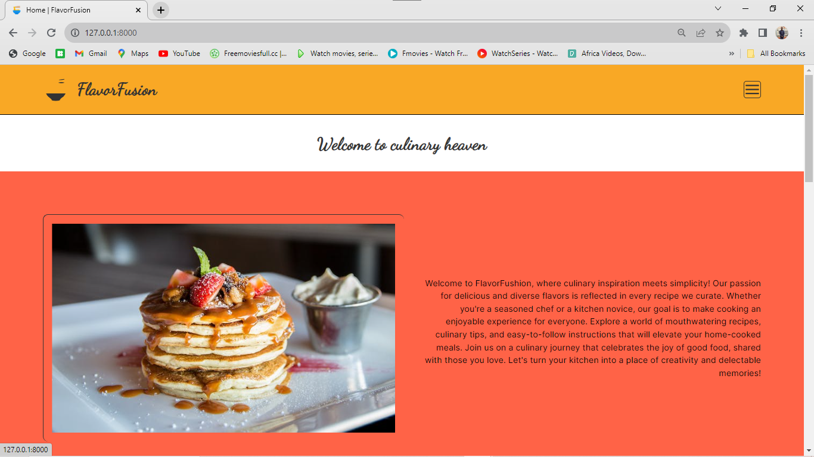
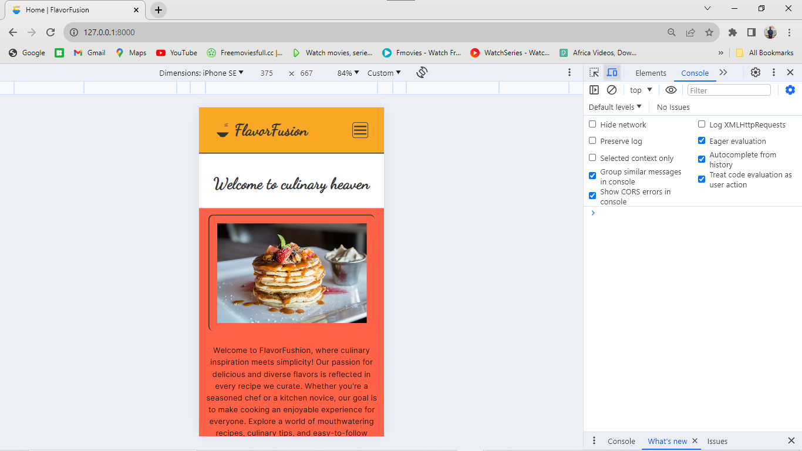
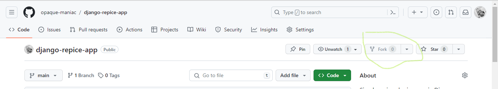
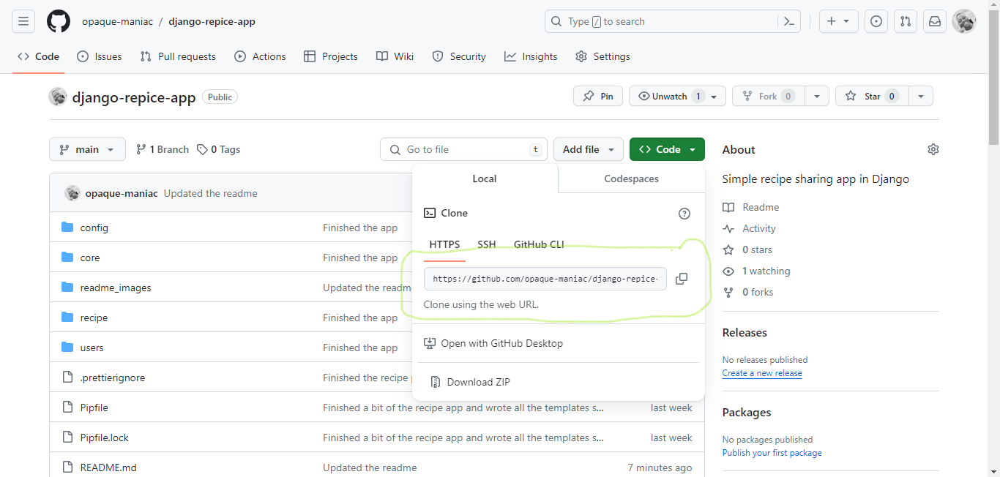
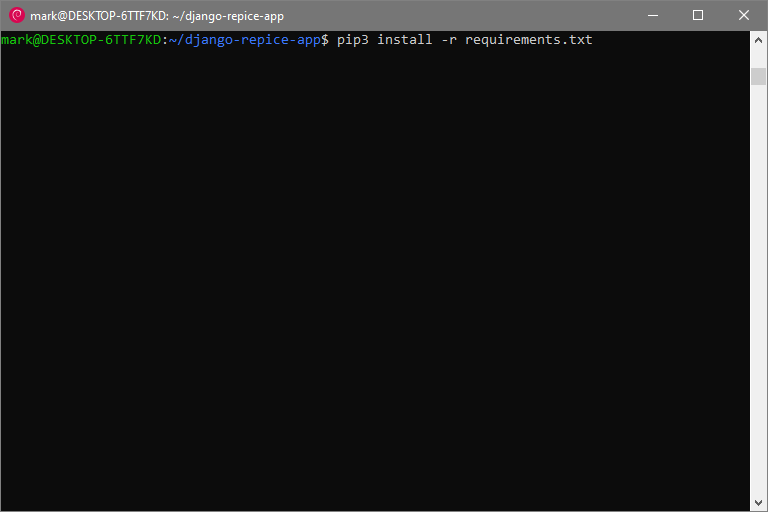
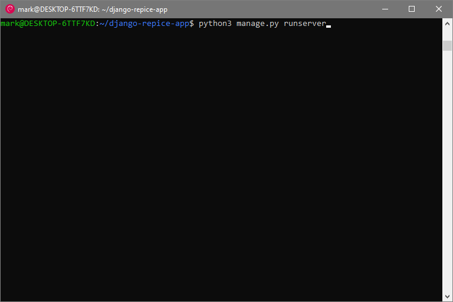
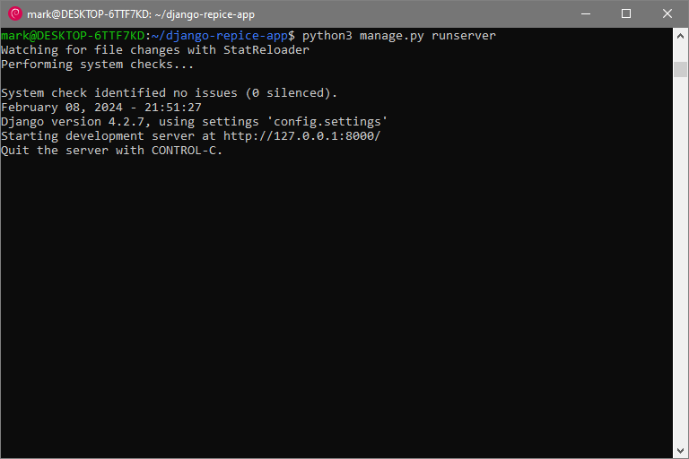

# django-repice-app
<h2 style="text-align: center; width: 100%;">Simple recipe sharing app in Django</h2>

    

    This is a simple Django recipe application. Users can register and read other people's recipe, as well as other recipes.

    The app is also mobile responsive.

    

    You can for the repository

    You can clone the repository using the link below.

    

    Install the requirements of the repostitory in the project direcotory   

<i>pip3 install -r requirements.py</i>

    

    Run the test server using the following command

<i>python3 manage.py runserver</i>

    

If successfull, this is what you should see

Now visit <a href="http://127.0.0.1">http://127.0.0.1</a> while test server is running and you will see the applications home page

    

